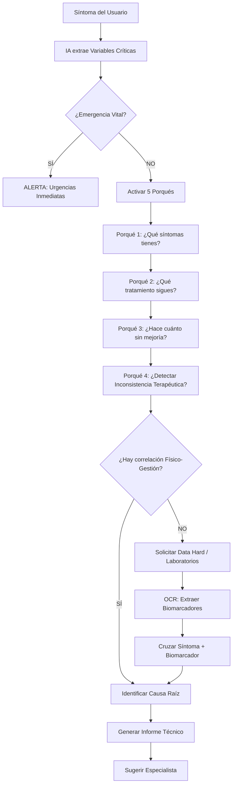

# 🏥 Sana-IA - Documentación del Proyecto

> **Motor de Inferencia Clínica basado en Análisis de Causa Raíz (ACR)** | NestJS + Google Gemini

---

## 📋 Resumen Ejecutivo

**Sana-IA** es un motor de **Inferencia Clínica** que utiliza la metodología de los **5 Porqués** para realizar un **Análisis de Causa Raíz (ACR)**. El sistema cruza síntomas narrativos del usuario con biomarcadores de laboratorio (Data Hard) para detectar **"Fallas de Sistema"** (Patologías Solapadas) que el diagnóstico estándar no pudo identificar.

### 💡 Propuesta de Valor Única
> "Sana es la unión de la lógica de procesos de ingeniería con la medicina avanzada. Piensa como un especialista senior, buscando el error en el sistema que otros no vieron."

### Stack Tecnológico
| Capa | Tecnología |
|------|------------|
| Framework | NestJS |
| Lenguaje | TypeScript |
| Base de Datos | SQLite (dev) / PostgreSQL (prod) |
| ORM | TypeORM |
| Autenticación | JWT + Passport |
| IA | Google Gemini 1.5 Pro (Multimodal) |
| OCR | Gemini Vision / Google Document AI |

---

## 🧠 Algoritmo de los 5 Porqués (Core del Sistema)

### ¿Qué es?
Es una metodología de ingeniería (R.F.G.) adaptada a medicina para encontrar la **causa raíz** de un problema de salud, no solo tratar síntomas superficiales.

### Flujo del Algoritmo



### Ejemplo Práctico

| Fase | Acción | Ejemplo |
|------|--------|---------|
| **Captura** | Usuario describe síntomas | "Tensión alta hace 2 años, tomo Losartán, sigo en 150/90" |
| **Detección** | IA detecta inconsistencia | Fármaco + Tiempo ≠ Resultado esperado |
| **Validación** | Solicitar laboratorios | Usuario sube química sanguínea |
| **OCR** | Extraer biomarcadores | Potasio: 3.1 mEq/L (bajo) |
| **Correlación** | Cruzar datos | Hipertensión + Hipopotasemia + Nicturia |
| **Causa Raíz** | Identificar patología | Hiperaldosteronismo Primario |
| **Output** | Informe + Especialista | "Consultar Endocrinología" |

---

## 🔄 Pipeline de Procesamiento

```
┌─────────────────────────────────────────────────────────────────────┐
│  ENTRADA                                                            │
│  ├─ Audio/Voz → Speech-to-Text                                      │
│  ├─ Texto → Sanitización                                            │
│  └─ Imagen Lab → OCR (Gemini Vision)                                │
└─────────────────────────────────────────────────────────────────────┘
                              ↓
┌─────────────────────────────────────────────────────────────────────┐
│  NÚCLEO IA (NestJS Services)                                        │
│  ├─ NLP Service: Extrae variables críticas                          │
│  ├─ OCR Service: Extrae biomarcadores                               │
│  ├─ Prompt Builder: Construye prompt con contexto                   │
│  └─ Context: Historial médico del usuario                           │
└─────────────────────────────────────────────────────────────────────┘
                              ↓
┌─────────────────────────────────────────────────────────────────────┐
│  INFERENCIA (Gemini 1.5 Pro)                                        │
│  ├─ Request Multimodal (texto + imagen)                             │
│  ├─ Algoritmo 5 Porqués                                             │
│  └─ JSON Response estructurado                                      │
└─────────────────────────────────────────────────────────────────────┘
                              ↓
┌─────────────────────────────────────────────────────────────────────┐
│  SALIDA                                                             │
│  ├─ Validación de schema                                            │
│  ├─ Persistencia en BD                                              │
│  ├─ Generación PDF (informe médico)                                 │
│  └─ Respuesta API al usuario                                        │
└─────────────────────────────────────────────────────────────────────┘
```

---

## 📤 Estructura de Respuesta IA (JSON Output)

La IA debe devolver un objeto estructurado, no texto plano:

```typescript
interface SanaInferenceOutput {
  status_inconsistencia: boolean;           // ¿Se detectó inconsistencia terapéutica?
  biomarcadores_detectados: Biomarcador[];  // Valores del laboratorio
  hipotesis_causa_raiz: string;             // Patología probable
  especialista_sugerido: string;            // Ej: "Endocrinología"
  nivel_confianza: number;                  // 0-100%
  requiere_data_hard: boolean;              // ¿Faltan laboratorios?
  disclaimer: string;                       // Aviso legal obligatorio
}

interface Biomarcador {
  nombre: string;        // Ej: "Potasio"
  valor: number;         // Ej: 3.1
  unidad: string;        // Ej: "mEq/L"
  rango_normal: string;  // Ej: "3.5-5.0"
  estado: 'bajo' | 'normal' | 'alto';
}
```

---

## ✅ Estado Actual del Proyecto

### Módulos Implementados

| Módulo | Estado | Descripción |
|--------|--------|-------------|
| `AuthModule` | ✅ Completo | Login, Refresh Tokens (Stateful), Logout, RBAC |
| `UsersModule` | ✅ Completo | CRUD usuarios, hashing bcrypt, relaciones |
| `RolesModule` | ✅ Completo | Roles admin/user |
| `DatabaseModule` | ✅ Completo | Configuración, Seeds |

### Módulos Pendientes

| Módulo | Estado | Descripción |
|--------|--------|-------------|
| `AiModule` | ❌ Pendiente | Motor de inferencia con Gemini |
| `OcrModule` | ❌ Pendiente | Procesamiento de imágenes de laboratorio |
| `ReportsModule` | ❌ Pendiente | Generación de informes PDF |
| `HistoryModule` | ❌ Pendiente | Historial de consultas del usuario |

---

## 📝 Requerimientos Funcionales

### RF-01: Disclaimer y Consentimiento
- **Descripción**: El sistema DEBE mostrar un descargo de responsabilidad antes de cualquier interacción.
- **Mensaje**: "Este sistema es REFERENCIAL y no sustituye al médico."
- **Estado**: ❌ Pendiente

### RF-02: Captura de Síntomas (Anamnesis)
- **Descripción**: El usuario puede describir síntomas por texto o voz.
- **Entradas**: Texto libre, audio (Speech-to-Text)
- **Estado**: ❌ Pendiente

### RF-03: Detección de Emergencias
- **Descripción**: Si los síntomas indican emergencia vital, redirigir a urgencias.
- **Lógica**: IA evalúa variables críticas
- **Estado**: ❌ Pendiente

### RF-04: Procesamiento OCR de Laboratorios
- **Descripción**: Extraer biomarcadores de imágenes de exámenes médicos.
- **Datos a extraer**: Nombre, valor, unidad (mg/dL, mEq/L, etc.)
- **Estado**: ❌ Pendiente

### RF-05: Algoritmo de 5 Porqués
- **Descripción**: Motor de razonamiento para encontrar causa raíz.
- **Metodología**: Ingeniería R.F.G.
- **Estado**: ❌ Pendiente

### RF-06: Generación de Informe
- **Descripción**: Crear PDF con lenguaje técnico para el médico.
- **Contenido**: Hipótesis, biomarcadores, especialista sugerido
- **Estado**: ❌ Pendiente

### RF-07: Autenticación y Seguridad
- **Estado**: ✅ Implementado

---

## 🚀 Próximos Pasos (Roadmap)

### Fase 1: Seguridad (Prioridad ALTA) 🔴
- [ ] Implementar Rate Limiting (`@nestjs/throttler`)
- [ ] Agregar Helmet para headers de seguridad
- [ ] Configurar CORS
- [ ] Implementar Disclaimer/Consentimiento obligatorio

### Fase 2: Módulo de IA - Core 🟡
- [ ] Instalar dependencias (`@google/generative-ai`, `zod`)
- [ ] Crear `AiModule`, `AiService`, `AiController`
- [ ] Diseñar **System Prompt** con metodología 5 Porqués
- [ ] Implementar endpoint `/ai/analyze`
- [ ] Validar respuesta JSON con Zod

### Fase 3: Módulo OCR 🟡
- [ ] Evaluar: Gemini Vision vs Google Document AI
- [ ] Crear `OcrModule`, `OcrService`
- [ ] Extraer biomarcadores de imágenes
- [ ] Detectar unidades de medida correctamente

### Fase 4: Historial y Reportes 🟢
- [ ] Crear `HistoryModule` para guardar consultas
- [ ] Crear `ReportsModule` para generar PDF
- [ ] Implementar endpoint `/reports/:id/download`

### Fase 5: Producción 🟣
- [ ] Migrar a PostgreSQL
- [ ] Configurar HTTPS
- [ ] Implementar encriptación de datos sensibles (HIPAA)
- [ ] Auditoría de accesos

---

## 💡 Recomendaciones Técnicas

### Para el Motor de IA
1. **RAG (Retrieval-Augmented Generation)**: Gemini debe usar bases de datos médicas validadas, no "adivinar".
2. **Filtro Científico**: Si no hay laboratorios, marcar como "hipótesis preliminar".
3. **Precisión OCR**: Reconocer unidades (mg/dL, mEq/L) para evitar errores.

### Para Seguridad Médica
1. **Disclaimer en CADA respuesta** - No solo al inicio
2. **NO almacenar** datos sin consentimiento explícito
3. **Logging** de todas las inferencias para trazabilidad
4. **Validar alucinaciones** - La IA puede inventar condiciones

### Para Arquitectura
1. **Streaming** para respuestas largas de IA
2. **Queue/Jobs** para análisis de imágenes pesadas
3. **Cache** de prompts similares

---

## 📦 Dependencias del Proyecto

### Instaladas
```json
{
  "@nestjs/common": "^10.x",
  "@nestjs/jwt": "^10.x",
  "@nestjs/passport": "^10.x",
  "passport-jwt": "^4.x",
  "bcrypt": "^5.x",
  "typeorm": "^0.3.x",
  "class-validator": "^0.14.x"
}
```

### Por Instalar (Módulo IA)
```bash
npm install @google/generative-ai zod
```

### Por Instalar (Seguridad)
```bash
npm install @nestjs/throttler helmet
```

### Opcional (Flujos Avanzados)
```bash
npm install langchain @langchain/google-genai pdfkit
```

---

## 🔧 Variables de Entorno

```env
# Base de Datos
DB_HOST=localhost
DB_PORT=5432
DB_USERNAME=postgres
DB_PASSWORD=secret
DB_NAME=sana_ia

# JWT
JWT_SECRET=tu-secreto-super-seguro
JWT_EXPIRATION=3600
JWT_REFRESH_SECRET=otro-secreto-diferente
JWT_REFRESH_EXPIRATION=7d

# IA (Gemini)
AI_API_KEY=tu-api-key-de-gemini
AI_MODEL=gemini-1.5-pro

# App
PORT=3000
NODE_ENV=development
```

---

## 📊 Evaluación del Proyecto

| Aspecto | Puntuación | Notas |
|---------|------------|-------|
| Seguridad | 8/10 | Base sólida, falta hardening |
| Core IA (5 Porqués) | 0/10 | No implementado aún |
| OCR | 0/10 | No implementado |
| Escalabilidad | 7/10 | OK para MVP |
| Código Base | 9/10 | Limpio, tipado |

---

## � Documentación Relacionada

- [Especificación Técnica](./docs/espTecnica.md)
- [Flujo ACR](./functional-docs/acr_logic_flow.md)
- [Pipeline del Sistema](./functional-docs/system_pipeline.md)
- [Diagrama de Interacción](./docs/mibrujula.md)

---

*Última actualización: 2026-02-03*
