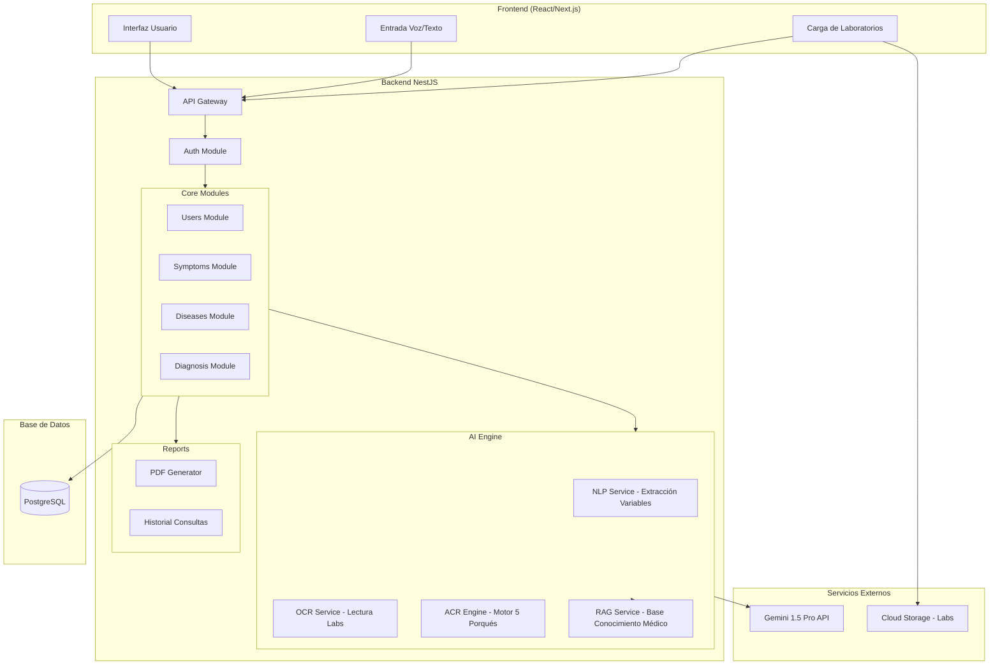

# Arquitectura del Sistema SANA

```mermaid
flowchart TB
    subgraph Frontend["Frontend (React/Next.js)"]
        UI[Interfaz Usuario]
        Voice[Entrada Voz/Texto]
        Upload[Carga de Laboratorios]
    end

    subgraph Backend["Backend NestJS"]
        API[API Gateway]
        Auth[Auth Module]
        
        subgraph Core["Core Modules"]
            Users[Users Module]
            Symptoms[Symptoms Module]
            Diseases[Diseases Module]
            Diagnosis[Diagnosis Module]
        end
        
        subgraph AI["AI Engine"]
            NLP[NLP Service - Extracción Variables]
            OCR[OCR Service - Lectura Labs]
            ACR[ACR Engine - Motor 5 Porqués]
            RAG[RAG Service - Base Conocimiento Médico]
        end
        
        subgraph Reports["Reports"]
            PDF[PDF Generator]
            History[Historial Consultas]
        end
    end

    subgraph External["Servicios Externos"]
        Gemini[Gemini 1.5 Pro API]
        Storage[Cloud Storage - Labs]
    end

    subgraph Database["Base de Datos"]
        DB[(PostgreSQL)]
    end

    UI --> API
    Voice --> API
    Upload --> API
    API --> Auth
    Auth --> Core
    Core --> AI
    AI --> Gemini
    AI --> RAG
    Core --> Reports
    Core --> DB
    Upload --> Storage
```
