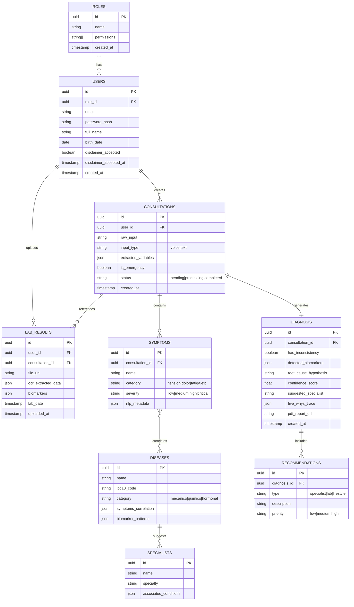

# Esquema de Base de Datos SANA

```mermaid
erDiagram
    ROLES ||--o{ USERS : has
    USERS ||--o{ CONSULTATIONS : creates
    USERS ||--o{ LAB_RESULTS : uploads
    CONSULTATIONS ||--o{ SYMPTOMS : contains
    CONSULTATIONS ||--o{ LAB_RESULTS : references
    CONSULTATIONS ||--|| DIAGNOSIS : generates
    SYMPTOMS }o--o{ DISEASES : correlates
    DIAGNOSIS ||--o{ RECOMMENDATIONS : includes
    DISEASES ||--o{ SPECIALISTS : suggests

    ROLES {
        uuid id PK
        string name
        string[] permissions
        timestamp created_at
    }

    USERS {
        uuid id PK
        uuid role_id FK
        string email
        string password_hash
        string full_name
        date birth_date
        boolean disclaimer_accepted
        timestamp disclaimer_accepted_at
        timestamp created_at
    }

    CONSULTATIONS {
        uuid id PK
        uuid user_id FK
        string raw_input
        string input_type "voice|text"
        json extracted_variables
        boolean is_emergency
        string status "pending|processing|completed"
        timestamp created_at
    }

    SYMPTOMS {
        uuid id PK
        uuid consultation_id FK
        string name
        string category "tension|dolor|fatiga|etc"
        string severity "low|medium|high|critical"
        json nlp_metadata
    }

    LAB_RESULTS {
        uuid id PK
        uuid user_id FK
        uuid consultation_id FK
        string file_url
        json ocr_extracted_data
        json biomarkers
        timestamp lab_date
        timestamp uploaded_at
    }

    DISEASES {
        uuid id PK
        string name
        string icd10_code
        string category "mecanico|quimico|hormonal"
        json symptoms_correlation
        json biomarker_patterns
    }

    DIAGNOSIS {
        uuid id PK
        uuid consultation_id FK
        boolean has_inconsistency
        json detected_biomarkers
        string root_cause_hypothesis
        float confidence_score
        string suggested_specialist
        json five_whys_trace
        string pdf_report_url
        timestamp created_at
    }

    RECOMMENDATIONS {
        uuid id PK
        uuid diagnosis_id FK
        string type "specialist|lab|lifestyle"
        string description
        string priority "low|medium|high"
    }

    SPECIALISTS {
        uuid id PK
        string name
        string specialty
        json associated_conditions
    }
```
