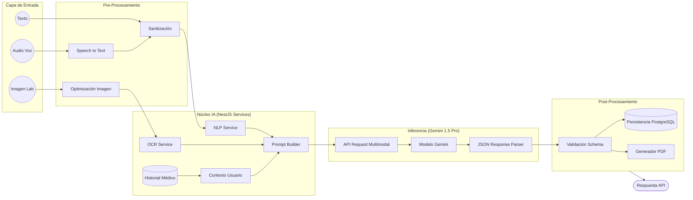

# Pipeline de Procesamiento del Sistema

Flujo técnico de cómo viajan y se transforman los datos a través de los servicios del Backend.

```mermaid
flowchart LR
    subgraph Input_Layer ["Capa de Entrada"]
        Audio((Audio Voz))
        Text((Texto))
        Image((Imagen Lab))
    end
    
    subgraph Pre_Processing ["Pre-Procesamiento"]
        Audio --> STT[Speech to Text]
        Text & STT --> Sanitize[Sanitización]
        Image --> Resize[Optimización Imagen]
    end
    
    subgraph AI_Core ["Núcleo IA (NestJS Services)"]
        Sanitize --> NLP_Svc[NLP Service]
        Resize --> OCR_Svc[OCR Service]
        
        NLP_Svc --> Prompt_Builder[Prompt Builder]
        OCR_Svc --> Prompt_Builder
        
        DB[(Historial Médico)] --> Context[Contexto Usuario]
        Context --> Prompt_Builder
    end
    
    subgraph Inference ["Inferencia (Gemini 1.5 Pro)"]
        Prompt_Builder --> Request[API Request Multimodal]
        Request --> LLM[Modelo Gemini]
        LLM --> Parser[JSON Response Parser]
    end
    
    subgraph Post_Processing ["Post-Procesamiento"]
        Parser --> Validator[Validación Schema]
        Validator --> DB_Save[(Persistencia PostgreSQL)]
        Validator --> PDF_Gen[Generador PDF]
    end
    
    Post_Processing --> API_Response([Respuesta API])
```
