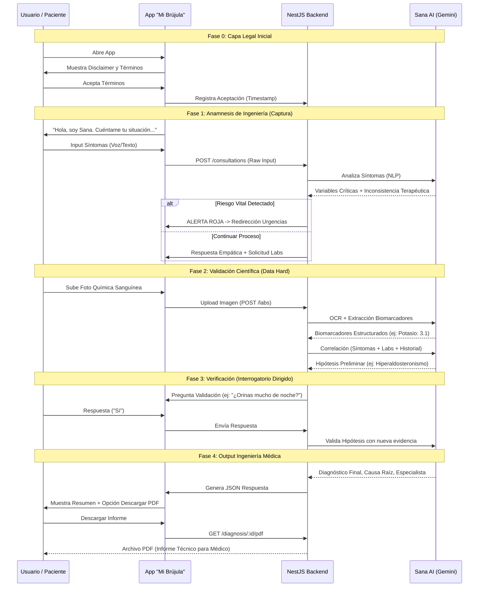

# Flujo de Interacción del Usuario SANA

Este diagrama detalla el protocolo de interacción **Sinergia Ingeniería-Medicina** descrito en la especificación técnica.

```mermaid
sequenceDiagram
    participant User as Usuario / Paciente
    participant Frontend as App "Mi Brújula"
    participant Backend as NestJS Backend
    participant AI_Sana as Sana AI (Gemini)
    
    Note over User, AI_Sana: Fase 0: Capa Legal Inicial
    User->>Frontend: Abre App
    Frontend->>User: Muestra Disclaimer y Términos
    User->>Frontend: Acepta Términos
    Frontend->>Backend: Registra Aceptación (Timestamp)
    
    Note over User, AI_Sana: Fase 1: Anamnesis de Ingeniería (Captura)
    Frontend->>User: "Hola, soy Sana. Cuéntame tu situación..."
    User->>Frontend: Input Síntomas (Voz/Texto)
    Frontend->>Backend: POST /consultations (Raw Input)
    Backend->>AI_Sana: Analiza Síntomas (NLP)
    AI_Sana-->>Backend: Variables Críticas + Inconsistencia Terapéutica
    
    alt Riesgo Vital Detectado


        Backend->>Frontend: ALERTA ROJA -> Redirección Urgencias
    else Continuar Proceso
        Backend->>Frontend: Respuesta Empática + Solicitud Labs
    end
    
    Note over User, AI_Sana: Fase 2: Validación Científica (Data Hard)
    User->>Frontend: Sube Foto Química Sanguínea
    Frontend->>Backend: Upload Imagen (POST /labs)
    Backend->>AI_Sana: OCR + Extracción Biomarcadores
    AI_Sana-->>Backend: Biomarcadores Estructurados (ej: Potasio: 3.1)
    
    Backend->>AI_Sana: Correlación (Síntomas + Labs + Historial)
    AI_Sana-->>Backend: Hipótesis Preliminar (ej: Hiperaldosteronismo)
    
    Note over User, AI_Sana: Fase 3: Verificación (Interrogatorio Dirigido)
    Backend->>Frontend: Pregunta Validación (ej: "¿Orinas mucho de noche?")
    User->>Frontend: Respuesta ("Sí")
    Frontend->>Backend: Envía Respuesta
    Backend->>AI_Sana: Valida Hipótesis con nueva evidencia
    
    Note over User, AI_Sana: Fase 4: Output Ingeniería Médica
    AI_Sana-->>Backend: Diagnóstico Final, Causa Raíz, Especialista
    Backend->>Frontend: Genera JSON Respuesta
    Frontend->>User: Muestra Resumen + Opción Descargar PDF
    User->>Frontend: Descargar Informe
    Frontend->>Backend: GET /diagnosis/:id/pdf
    Backend-->>User: Archivo PDF (Informe Técnico para Médico)
```
